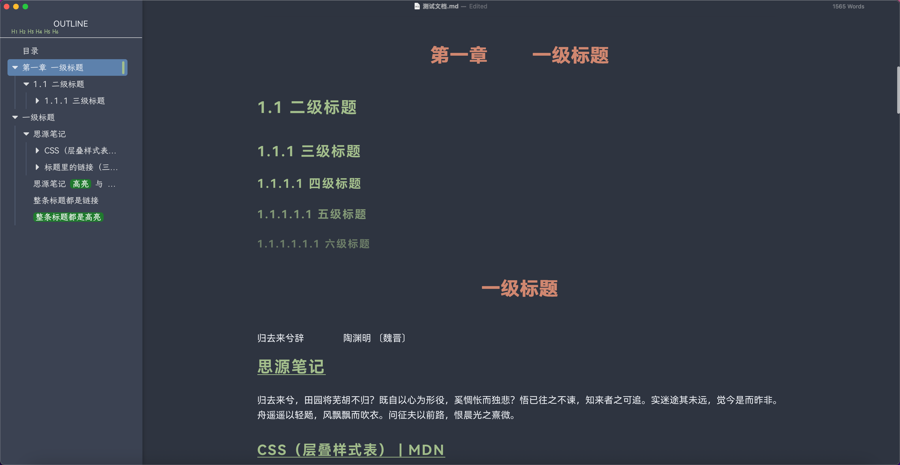

# dexter-seeyue

**给长文写作的一套排版秩序**

[SeeYue](https://github.com/jinghu-moon/typora-see-yue-theme) 的暗色魔改自用版 · for Typora

## 改了什么

上游是 SeeYue v1.4.0（三个配色）。这里只留暗色一套，并在其基础上改了这些：

| 项目 | 改法 | 文件 |
| :-: | --- | --- |
| macOS 上侧边栏白底、白字看不见 | 补上 Typora 核心读取的 `--bg-color` / `--side-bar-bg-color` / `--text-color` | `configs/dark-config.css` |
| 标题等级提示、引用块竖线、代码块语言标签跑到正文左上角 | `#write` 的 `position` 由 `static` 改回 `relative` | `write-area.css` |
| 正文标题左侧的 H1~H6 小标签压住侧边栏图标 | 关掉 | `configs/dark-config.css` |
| 长表格、长代码块内部滚动 | 关掉 | `configs/dark-config.css` |
| 图片最大宽度 85%、悬停会放大 | 改成 100%、不放大 | `configs/dark-config.css` |
| 高亮是「马克笔涂抹」 | 改成圆角色块，`#1f7a2e` 底 + 白字 | `custom/custom-dark.css` |
| H2 有蓝色底条 + 下方蓝线，和 H3/H4 不是一套 | 去掉，并入 H3/H4 色系；标题里的链接改成字色继承 + 下划线 | `custom/custom-dark.css` |
| 大纲小三角悬停变橙 `#e87040` | 改成三角保持本色 + 选中蓝半透明底衬 | `custom/custom-dark.css` |

其余文件与上游一字不差，方便日后照上游升级。

## 装进 Typora

把 `my-see-yue-dark.css` 和 `MySeeYue/` 文件夹一起放进主题目录（两者必须同级，入口按 `./MySeeYue/` 找）：

- macOS：`~/Library/Application Support/abnerworks.Typora/themes/`
- Windows：`%APPDATA%\Typora\themes\`
- Linux：`~/.config/Typora/themes/`

然后 <kbd>Ctrl</kbd> + <kbd>R</kbd>，在主题菜单里选 `my-see-yue-dark`。

## 想改哪里

- 配色、字号、各种开关：`MySeeYue/CSS/configs/dark-config.css`，注释很全。
- 自己新加的效果：`MySeeYue/CSS/custom/custom-dark.css`（升级不覆盖）。
- 换字体：字体丢进 `MySeeYue/Fonts/`，改 `MySeeYue/CSS/fonts.css`。

## 致谢

主题原作 [SeeYue](https://github.com/jinghu-moon/typora-see-yue-theme) © jinghu-moon。字体与图片资源均来自上游、未作修改，使用前请遵守原作者的许可约定。
